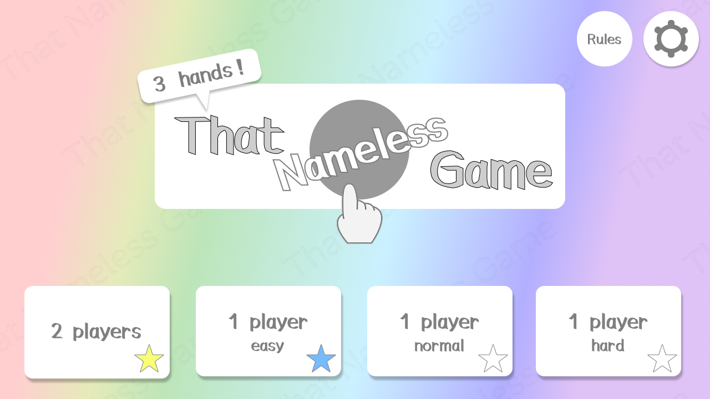
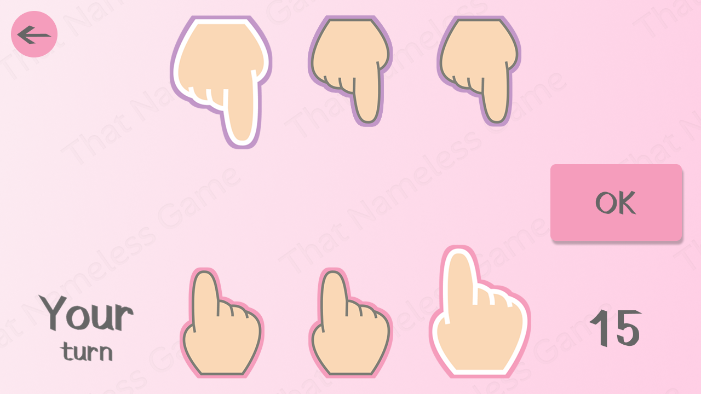
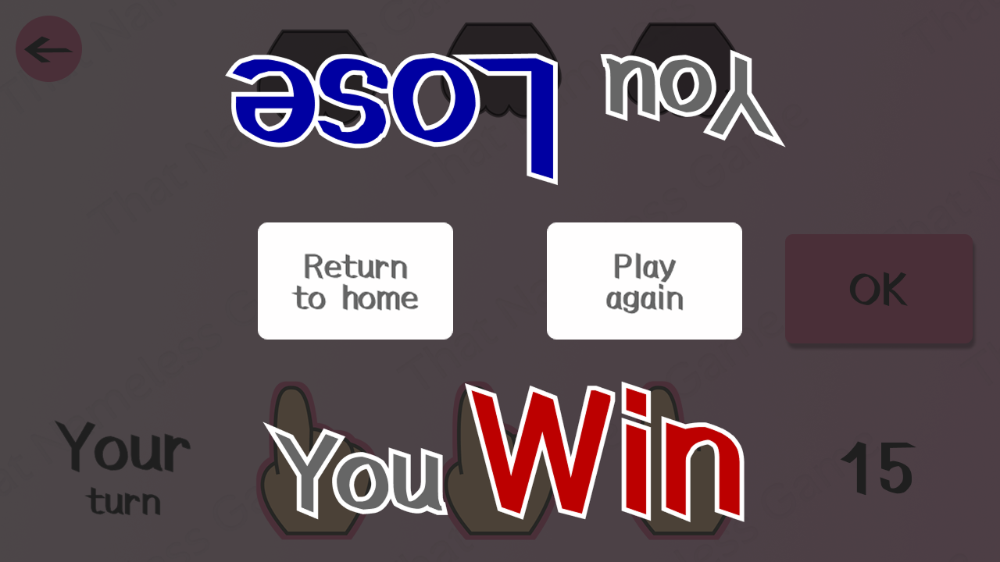
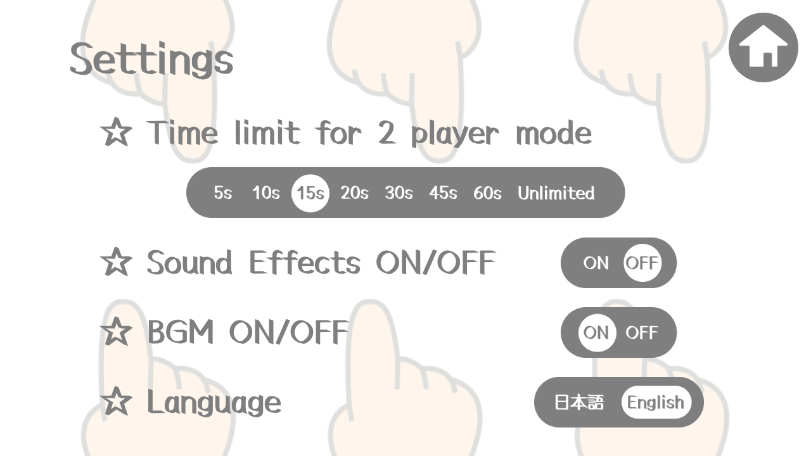

# 名もなきあの遊び（That Nameless Game）

[日本語版はこちら](README_jp.md)

A Flutter game for two players or solo play against a CPU. Each player has three hands: choose one active hand of your own and one active hand of your opponent's, then add the finger counts. A hand disappears when its count reaches five.

This repository is publicly available as a portfolio and technical-evaluation project. The design, images, audio, and source code are not licensed for reuse; see [LICENSE](LICENSE).

## Documentation

- Specifications: [Japanese](docs/specifications_ver2_jp.md) / [English](docs/specifications_ver2_en.md)
- Detailed design: [Japanese](docs/detail_design_jp.md) / [English](docs/detail_design_en.md)

## Screenshots

| Home — mode selection and achievement stars | Gameplay |
| --- | --- |
|  |  |
| **Result** | **Settings** |
|  |  |

## Features

- Four modes: local two-player, and Easy, Normal, and Hard CPU opponents
- Japanese and English UI
- Adjustable two-player time limit; BGM and sound-effect controls
- Persistent achievements and play records, displayed as stars on the home screen
- A fixed 16:9 landscape game canvas that scales to different screen sizes

## Rules

Both players begin with three hands. A move adds the number on one of your non-zero hands to one non-zero opposing hand. Counts use modulo five, so a hand reaching five becomes zero and disappears.

Eliminate all three opposing hands to win. When the same position appears again, the game compares the number of remaining hands; equal counts result in a draw.

## Tech Stack

| Area | Technology |
| --- | --- |
| Framework | Flutter / Dart |
| State management | Riverpod |
| Persistence | shared_preferences |
| Audio | audioplayers |
| Testing | flutter_test |
| Platforms | Android / iOS |

## Implementation Highlights

### UI-independent game rules

[`lib/game/game_engine.dart`](lib/game/game_engine.dart) contains legal-move validation, win/loss decisions, and position history independently of Widgets and audio. Positions are immutable, making past state safe to inspect while animations and CPU calculations are in progress. This keeps rule changes and rule tests independent from the UI.

### Safe coordination of asynchronous game events

CPU calculations, countdowns, attack animations, and exit confirmation all run on different timelines. [`lib/play/play_session.dart`](lib/play/play_session.dart) assigns each match an operation ID, preventing stale CPU results or callbacks from an earlier match from updating a new one. It also manages timers and CPU presentation across backgrounding and exit confirmation.

### Difficulty designed as player experience

CPU modes change more than the selected move: their strategy, time limit, and visible selection sequence differ by difficulty. Showing the CPU's selection sequence makes the opponent's move understandable instead of appearing abruptly.

### Resilient startup and audio lifecycle

Settings, images, and audio are prepared before the game is displayed. Audio initialization or playback failures do not prevent the game from launching. Audio and game progression are also adjusted for foreground/background transitions.

### Tests for time-sensitive state changes

Tests cover game rules, setting persistence, audio state, and initialization, as well as countdowns, timeouts, exit confirmation, background restoration, and CPU turns. `FakeClock` and replaceable dependencies make those tests deterministic rather than dependent on wall-clock time.

## Project Structure

```text
lib/
├── game/             # Rules, positions, and outcome decisions
├── play/             # Match flow, CPU behavior, and presentation scheduling
├── screens/          # Home, gameplay, rules, and settings screens
├── settings/         # Settings and achievement persistence
├── audio/            # BGM and sound-effect control
└── initialization/   # Startup workflow

test/                 # Logic, state-transition, and widget tests
docs/                 # Specifications and licensing information
```


## About This Public Repository

Game images, audio, fonts, part of the CPU implementation, and detailed design documents are excluded to protect rights. Therefore, this public version is not directly buildable on its own. The published code and tests are provided to demonstrate the architecture, state management, game-rule implementation, and quality practices.

## License and Credits

Copying, modifying, redistributing, or commercially using this work—including its source code, UI, and assets—is prohibited. Third-party asset credits are listed in [docs/license.en.md](docs/license.en.md) and [docs/license.jp.md](docs/license.jp.md).
