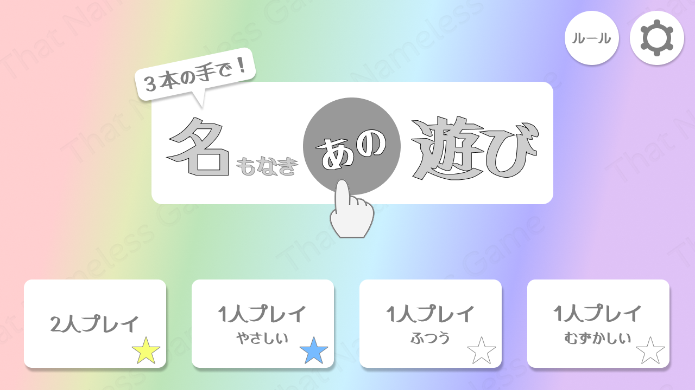
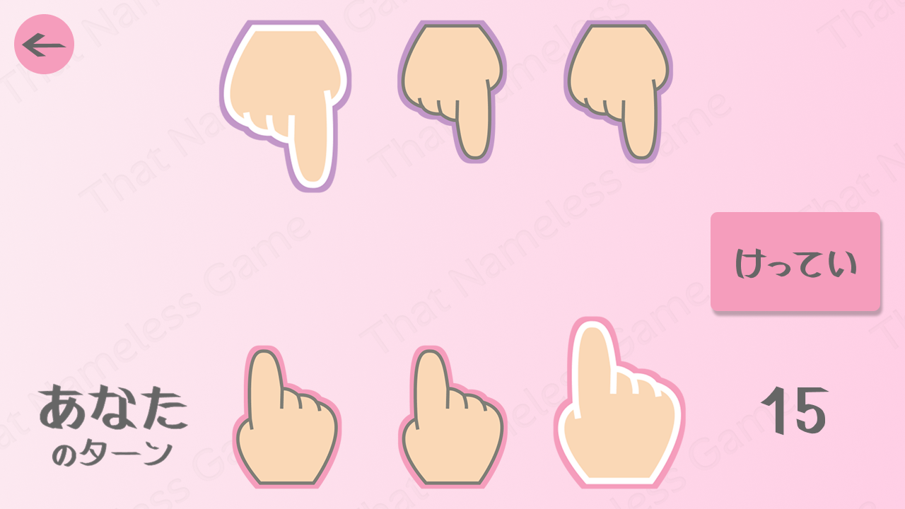
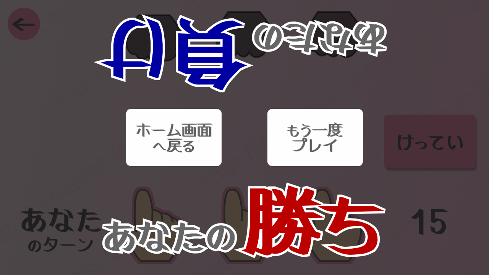
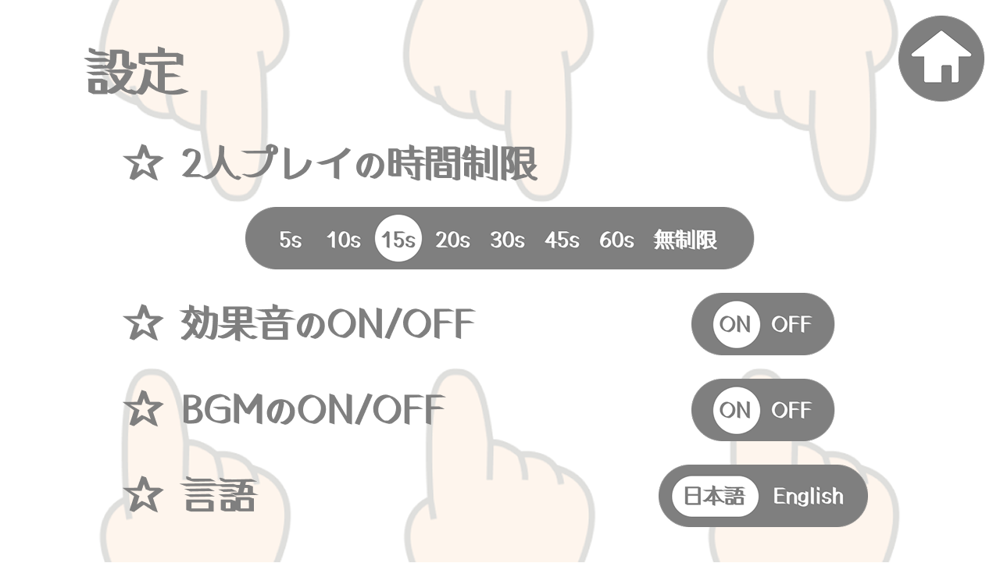

# 名もなきあの遊び（That Nameless Game）

[English README](README.md)

Flutterで制作した、3本の手を使う対戦ゲームです。自分と相手の手を1本ずつ選び、相手の手の指の数を加算します。合計が5になった手は消滅し、すべての手を消した側が負けです。

就職活動におけるポートフォリオ／技術評価を目的に公開しています。UIデザイン・画像・音声を含む制作物の権利は保持しているため、転載は禁止転載・流用はご遠慮ください。詳しくは[LICENSE](LICENSE)をご確認ください。

## スクリーンショット

| ホーム（モード選択・達成スター） | 対戦画面 |
| --- | --- |
|  |  |
| **結果画面** | **設定画面** |
|  |  |

## できること

- 2人対戦、CPU対戦（かんたん・ふつう・むずかしい）の4モード
- 日本語／英語の切り替え
- 2人対戦の制限時間設定、BGM・効果音のON/OFF
- 勝利やプレイ回数を記録し、ホーム画面のスター表示に反映
- 横画面・16:9を基準に、端末の画面比率が異なってもゲーム画面を保つ表示

## ルール

各プレイヤーは3本の手を持ちます。自分の0ではない手と、相手の0ではない手を1本ずつ選択すると、相手の手の数が加算されます。数は5で循環するため、5になった手は0（消滅）です。

相手の3本の手をすべて0にすると勝利します。同じ局面が再び現れた場合は、残っている手の数で勝敗を判定し、同数なら引き分けにします。

## 技術スタック

| 分類 | 使用技術 |
| --- | --- |
| フレームワーク | Flutter / Dart |
| 状態管理 | Riverpod |
| 永続化 | shared_preferences |
| 音声 | audioplayers |
| テスト | flutter_test |
| 対象プラットフォーム | Android / iOS |

## 工夫したポイント

### ルールをUIから分離

勝敗判定・合法手判定・局面履歴は[`lib/game/game_engine.dart`](lib/game/game_engine.dart)に集約し、Widgetや音声処理から切り離しました。局面はイミュータブルに扱うため、アニメーション中やCPU思考中でも過去の状態を安全に参照できます。これにより、ルール変更やテストの対象を画面実装から独立させています。

### 非同期処理と画面遷移の競合を防止

CPU思考、カウントダウン、攻撃アニメーション、終了確認はそれぞれタイミングを持つ処理です。[`lib/play/play_session.dart`](lib/play/play_session.dart)では対局ごとの操作IDを用意し、古いCPUの計算結果や画面コールバックが、新しい対局に反映されないようにしています。バックグラウンド遷移や終了確認中のタイマー／CPU演出も状態ごとに制御しています。

### 難易度ごとの体験を設計

CPU対戦は単に手を変えるだけでなく、難易度ごとに思考方法・制限時間・選択演出を切り替えています。CPUが手を選ぶ過程を段階的に見せることで、結果だけが突然反映されない対戦体験を目指しました。

### 起動時の体験と障害耐性

起動時に設定・画像・音声を準備し、完了後にアプリを表示します。音声の初期化や再生に失敗しても、ゲーム本体は起動を継続します。また、アプリが前面／背面にある状態に応じて音声とゲーム進行を調整しています。

### テストで仕様を守る

ゲームルール、設定の保存、音声状態、起動処理に加え、カウントダウン・時間切れ・終了確認・バックグラウンド復帰・CPU手番など、時間と状態が絡むケースをテストしています。`FakeClock`や差し替え可能な依存関係を使い、実時間に依存しない検証にしています。

## ディレクトリ構成

```text
lib/
├── game/             # ルール、局面、勝敗判定
├── play/             # 対局の進行、CPU、演出スケジューリング
├── screens/          # ホーム、プレイ、ルール、設定画面
├── settings/         # 設定とプレイ実績の保存
├── audio/            # BGM・効果音の制御
└── initialization/   # 起動時の初期化

test/                 # ロジック・状態遷移・画面のテスト
docs/                 # 仕様書・ライセンス情報
```

## 公開リポジトリについて

本リポジトリでは、権利保護のためゲーム用画像・音声・フォント、一部のCPU実装、詳細な設計資料を公開対象から除外しています。そのため、この公開版だけではそのままビルド・実行できません。公開しているコードとテストは、アーキテクチャ、状態管理、ルール実装、品質担保の取り組みを確認いただくためのものです。

## ライセンス・クレジット

ソースコード、UI、アセットを含む本制作物は無断での複製・改変・再配布・商用利用を禁止しています。利用素材のクレジットは[docs/license.jp.md](docs/license.jp.md)および[docs/license.en.md](docs/license.en.md)に記載しています。
